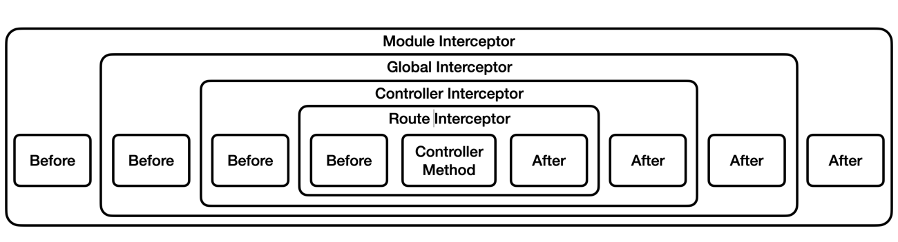
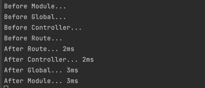

## Interceptor
- 요청과 응답을 가로채서 변형을 가할 수 있는 컴포넌트
  - 메서드 실행 전/후 추가 로직 바인딩
  - 함수에서 반환된 결과를 변환
  - 함수에서 던져진 예외를 변환
  - 기본 기능의 동작을 확장
  - 특정 조건에 따라 기능을 완전히 재정의(예: 캐싱)

### Interceptor 의 종류
- Global Interceptor
  - 모든 요청과 응답에 적용되는 인터셉터
- Controller Interceptor
  - 특정 컨트롤러에 적용하는 인터셉터
- Route Interceptor
  - 특정 요청에만 적용하는 인터셉터
- Module Interceptor
  - 특정 모듈에만 적용하는 인터셉터

### Interceptor 적용
```typescript
// Global
@Injectable()
export class LoggingInterceptor implements NestInterceptor {
  intercept(context: ExecutionContext, next: CallHandler): Observable<any> {
    console.log('Before Global...');

    const now = Date.now();
    return next
      .handle()
      .pipe(tap(() => console.log(`After Global... ${Date.now() - now}ms`)));
  }
}

async function bootstrap() {
  const app = await NestFactory.create(AppModule);

  app.useGlobalInterceptors(new LoggingInterceptor());

  await app.listen(3000);
}
bootstrap();


// Controller & Route
@Injectable()
export class ControllerInterceptor implements NestInterceptor {
  intercept(context: ExecutionContext, next: CallHandler): Observable<any> {
    console.log('Before Controller...');

    const now = Date.now();
    return next
            .handle()
            .pipe(
                    tap(() => console.log(`After Controller... ${Date.now() - now}ms`)),
            );
  }
}

@Injectable()
export class RouteInterceptor implements NestInterceptor {
  intercept(context: ExecutionContext, next: CallHandler): Observable<any> {
    console.log('Before Route...');

    const now = Date.now();
    return next
            .handle()
            .pipe(tap(() => console.log(`After Route... ${Date.now() - now}ms`)));
  }
}

@Controller()
@UseInterceptors(new ControllerInterceptor())
export class AppController {
  constructor(private readonly appService: AppService) {}

  @Get()
  getHello(): string {
    return this.appService.getHello();
  }

  @UseInterceptors(new RouteInterceptor())
  @Get('call')
  call(): string {
    return 'call';
  }
}


// Module
@Injectable()
export class ModuleInterceptor implements NestInterceptor {
  intercept(context: ExecutionContext, next: CallHandler): Observable<any> {
    console.log('Before Module...');

    const now = Date.now();
    return next
            .handle()
            .pipe(tap(() => console.log(`After Module... ${Date.now() - now}ms`)));
  }
}

@Module({
  imports: [],
  controllers: [AppController],
  providers: [
    AppService,
    {
      provide: APP_INTERCEPTOR,
      useClass: ModuleInterceptor,
    },
  ],
})
export class AppModule {}
```

### Interceptor 적용 순서

