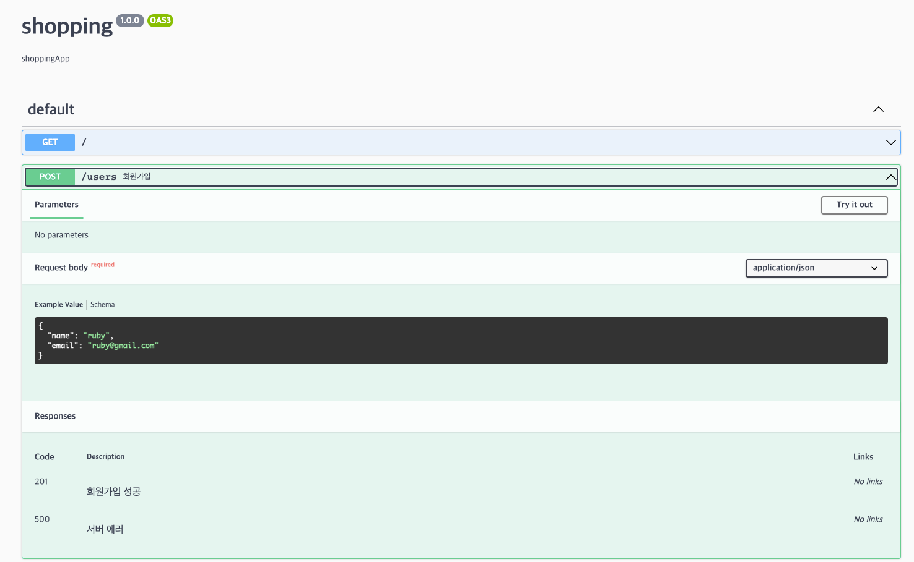

## Swagger
- 개발자가 REST 웹 서비스를 문서화할 수 있게 도와주는 프레임워크

### 패키지 설치
- npm i @nestjs/swagger 
- npm i swagger-ui-express
- npm i express-basic-auth
  - API 문서에 접근시 보안을 위해 설치

### Swagger 설정
```typescript
async function bootstrap() {
  const app = await NestFactory.create(AppModule);

  const swaggerConfig = new DocumentBuilder()
    .setTitle('shopping')
    .setDescription('shoppingApp')
    .setVersion('1.0.0')
    .build();
  const document: OpenAPIObject = SwaggerModule.createDocument(
    app,
    swaggerConfig,
  );
  SwaggerModule.setup('docs', app, document); // API 문서를 조회하기 위한 경로를 지정. localhost:3000/docs

  await app.listen(3000);
}
bootstrap();
```

### 요청 값에 Swagger 적용
```typescript
export class SignUpUser {
  @ApiProperty({
    example: 'ruby',
    description: '사용자 이름',
    required: true,
  })
  name: string;

  @ApiProperty({
    example: 'ruby@gmail.com',
    description: '사용자 이메일',
    required: true,
  })
  email: string;
}

// 엔티티에 설정해놓은 APIProperty 를 재사용할 수 있다.
export class UserInfo extends PickType(User, ['id', 'name', 'email']) {}

@Entity()
export class User {
  @ApiProperty({
    example: 1,
    description: '사용자 ID',
  })
  @PrimaryGeneratedColumn()
  id: number;

  @ApiProperty({
    example: 'ruby',
    description: '사용자 이름',
  })
  @Column()
  name: string;

  @ApiProperty({
    example: 'ruby@gmail.com',
    description: '사용자 이메일',
  })
  @Column()
  email: string;
}
```

### 응답 값에 Swagger 적용
```typescript
@Controller('users')
export class UserController {
  constructor(private readonly userRepository: UserRepository) {}

  @ApiOperation({ summary: '회원가입' })
  @ApiResponse({
    status: 201,
    description: '회원가입 성공',
  })
  @ApiResponse({
    status: 500,
    description: '서버 에러',
  })
  @Post()
  async postUser(@Body() signUpUser: SignUpUser) {
    console.log(signUpUser);
    await this.userRepository.insert({ ...signUpUser });
  }

  @ApiOperation({ summary: '회원 정보 조회' })
  @ApiResponse({
    status: 200,
    description: '회원 상세 정보',
    type: UserInfo,
  })
  @ApiResponse({
    status: 404,
    description: '회원 정보가 존재하지 않음',
  })
  @Get(':id')
  async getUser(@Param('id') id: number): Promise<UserInfo> {
    return this.userRepository.findOneBy({ id });
  }
}
```

### Swagger 문서 조회
- SwaggerModule.setup 에 설정해놓은 url 경로로 요청하여 조회
  - ex) localhost:3000/docs


### API 문서 접근제한을 위한 인증 추가
- 문서 접근시 설정한 username 과 password 를 입력해야한다.
```typescript
app.use(
  ['/docs'],
  expressBasicAuth({
    challenge: true,
    users: {
      [process.env.SWAGGER_USER]: process.env.SWAGGER_PASSWORD,
    },
  }),
);
```