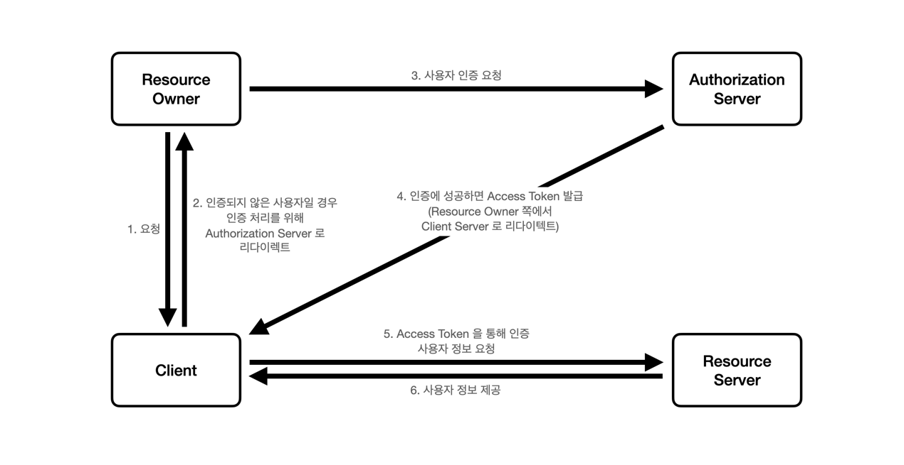
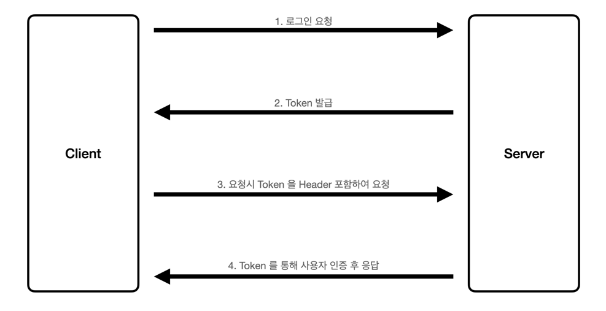

## OAuth2
### 패키지 설치
- npm i passport
- npm i @nestjs/passport
- npm i passport-google-oauth20

### OAuth 인증 흐름

- Resource Server
  - 사용자의 정보를 보관하고 제공하는 서버
    - 인증 및 인가를 거쳐 이메일, 이름 등 사용자의 리소스를 제공
  - Resource Server 와 Authorization Server 는 동일한 서버로 운영될 수도 있음
- Authorization Server
  - 권한 서버
  - Access Token, Refresh Token 을 발급 및 관리
- Client
  - Resource Owner 를 대리하여 리소스 요청을 하는 애플리케이션
    - Resource Owner 가 인증을 통해 발급받은 Access Token 을 통해 Resource Server 로부터 사용자의 정보를 요청
    - ex) 인프런, 쿠팡 등
- Resource Owner
  - 사용자. 계정의 소유자

## Json Web Token
### 패키지 설치
- npm i passport-jwt
- npm i @nestjs/jwt

### JWT 인증 흐름

- Access Token
  - 사용자 인증을 위한 토큰
    - 사용자 이메일, 이름 등의 정보를 포함하여 암호화하여 생성한다.
    - 탈취될 위험을 고려하여 비밀번호 등의 민감한 정보는 포함하지 않아야 한다.
    - 사용자 정보를 통해 만들어진 토큰으로 일반적으로 보안을 위해 유효기간을 짧게 설정한다.
- Refresh Token
  - Access Token 을 재발급할 때 사용되는 토큰
    - Access Token 의 유효기간이 만료되었을 때 사용자에게 다시 로그인을 요청하지 않고 Refresh Token 을 통해 Access Token 을 재발급받는다.