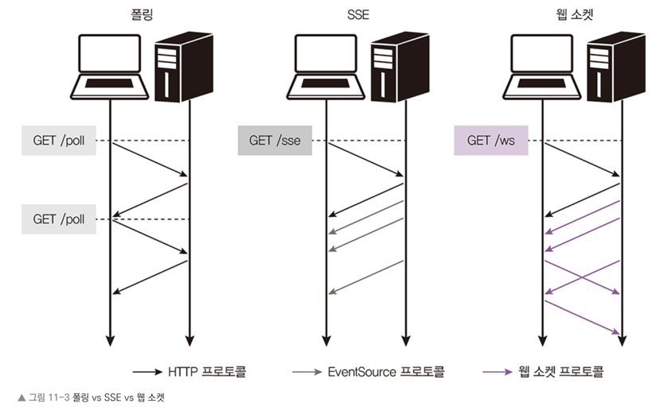
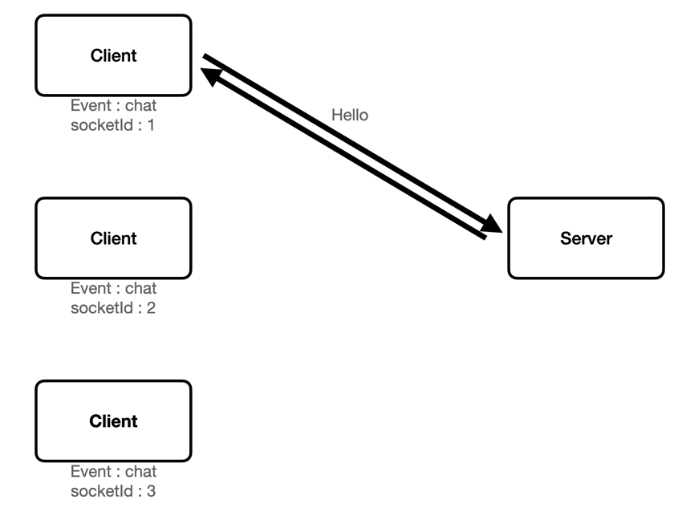
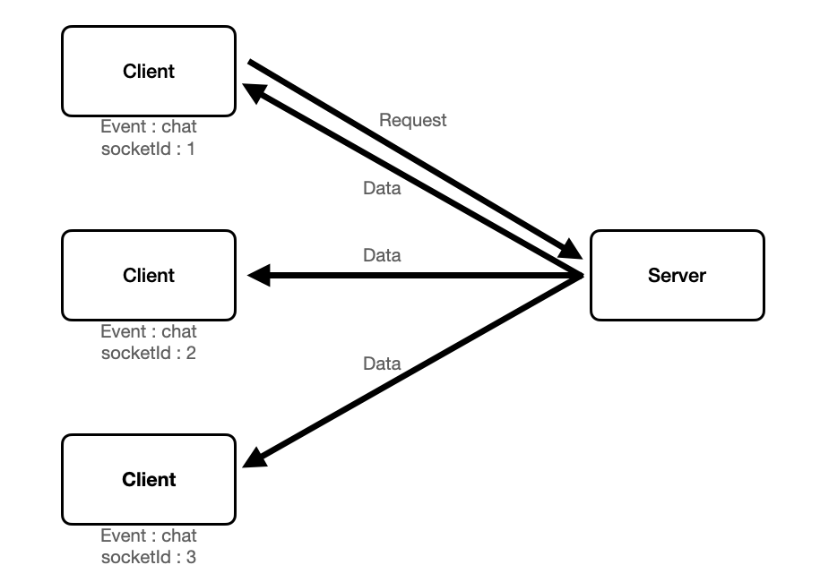

## Web Socket
- 실시간 양방향 데이터 전송을 위한 기술
- HTTP 가 아닌 WS 프로토콜을 사용
- 노드는 wa 나 Socket.IO 같은 패키지를 통해 웹 소켓 사용 가능  
  
*폴링 방식은 단방향이며 클라이언트 요청-서버 응답으로만 데이터 전송이 이루어지며 짧은 간격으로 계속 요청을 보내므로 서버에 부담이 크다.<br>반면, 웹 소켓은 양방향 통신이므로 소켓이 연결되어 있다면 클라이언트의 요청이 없어도 서버쪽에서 데이터를 보낼 수 있다.*

## Socket.IO
- 실시간 웹 애플리케이션을 위한 이벤트 기반 라이브러리
- 웹 클라이언트와 서버 간의 실시간 양방향 통신을 지원

### 패키지
- npm i @nestjs/websockets
- npm i @nestjs/platform-socket.io

### UniCast
- 고유 주소로 식별된 하나의 네트워크 목적지에 1:1로 트래픽 또는 메시지를 전송하는 방식  

```typescript
// namespace 지정. 해당 namespace 와 동일한 소켓의 클라이언트들에 요청과 응답을 처리한다.
@WebSocketGateway({ namespace: 'customSpace' }) 
export class ChatsGateway {

  // 클라이언트 쪽에서 socket.emit 을 통해 해당 이벤트를 지정하여 전송하며 서버쪽에서 이벤트를 처리
  @SubscribeMessage('uniCast') 
  handleUniCastMessage(
    @MessageBody() data: string, // 클라이언트에서 보낸 데이터
    @ConnectedSocket() socket: Socket,
  ) {
    console.log(`socket.id : ${socket.id}`); // 연결된 클라이언트마다 socketId가 다르게 부여된다.

    // 요청을 보낸 socketId 에 해당하는 클라이언트에게 전송
    socket.emit(`${socket.id} 의 메시지 : ${data}`);
  }
}
```


### BroadCast
- 송신 가능한 모든 목적지에 동일 데이터를 전송하는 방식  

```typescript
@WebSocketGateway({ namespace: 'customSpace' })
export class ChatsGateway {
  @SubscribeMessage('broadCasting')
  handleBroadCastMessage(
    @MessageBody() data: string, // 클라이언트에서 보낸 데이터
    @ConnectedSocket() socket: Socket,
  ) {
    console.log(`socket.id : ${socket.id}`); // 연결된 클라이언트마다 socketId가 다르게 부여된다.

    // 연결된 모든 클라이언트들에게 전송
    socket.broadcast.emit(`${socket.id} 의 메시지 : ${data}`);
  }
}
```

### Gateway
- @WebSocketGateway() 데코레이터로 주석이 달린 클래스
- 기본적으로 socket.io 패키지를 사용하여 기본 웹 소켓 구현을 포함, 다른 라이브러리와의 호환성을 제공
```typescript
// Gateway 및 Socket 생명주기
@WebSocketGateway({ namespace: 'chatsGatewayInit' })
export class ChatsGatewayLifeCycle
  implements OnGatewayInit, OnGatewayConnection, OnGatewayDisconnect
{
  private logger = new Logger('chat');

  // Gateway 객체가 생성 후 실행됨
  afterInit(server: any): any {
    this.logger.log('gateway init');
  }

  // 클라이언트와 연결이 되었을 때 작동
  handleConnection(@ConnectedSocket() socket: Socket): any {
    this.logger.log(`connect : ${socket.id}`);
  }

  // 클라이언트와 연결이 종료되었을 때 작동
  handleDisconnect(@ConnectedSocket() socket: Socket): any {
    this.logger.log(`disconnect : ${socket.id}`);
  }
}
```