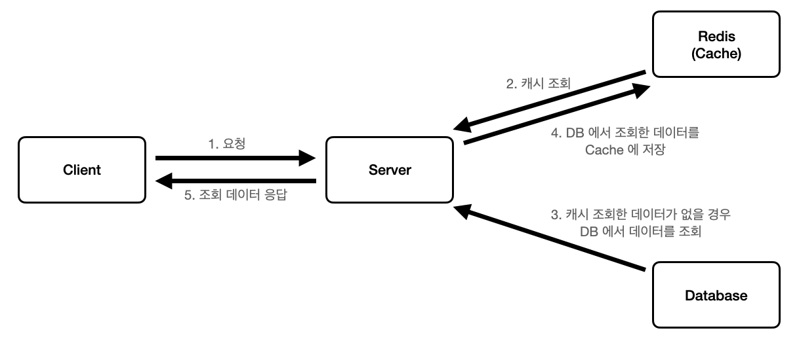

## Redis
- Remote Dictionary Server
- 키-값 구조의 비정형 데이터를 저장하고 관리하기 위한 비관계형 데이터베이스 관리 시스템
- 모든 데이터를 메모리로 불러와서 처리하는 메모리 기반의 DBMS
  - 메모리에서 데이터를 처리하기 때문에 디스크에 데이터를 처리하는 일반적인 데이터베이스에 비해 속도가 월등히 빠름
  - 메모리에서 데이터를 처리하기 때문에 영구적으로 데이터를 보관하는 것이 아닌 캐시용으로 적합

### 패키지 설치
- npm i cache-manager
- npm i @types/cache-manager
- npm i cache-manager-ioredis

### 캐시 조회 흐름
