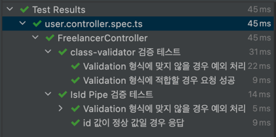

## class-validator
### 패키지 설치
- npm i class-validator
- npm i @nestjs/class-validator
- npm i class-transformer

### ValidationPipe Global 설정
```typescript
async function bootstrap() {
  const app = await NestFactory.create(AppModule);

  app.useGlobalPipes(
    new ValidationPipe({
      whitelist: true,
      forbidNonWhitelisted: true,
      transform: true,
      transformOptions: {
        enableImplicitConversion: true,
      },
    }),
  );

  await app.listen(3000);
}
bootstrap();
```

### DTO 에 Class-Validator 적용
```typescript
export class UserSignUp {
  @IsNotEmpty({ message: CommonErrorMessage.INVALID_NAME })
  name: string;

  @IsEmail({ message: CommonErrorMessage.INVALID_EMAIL })
  email: string;
}
```

### Controller 의 파라미터에 커스텀 Pipe 적용
```typescript
// Custom Pipe
@Injectable()
export class IdPipe implements PipeTransform {
  isId(id: number) {
    return id > 0;
  }

  transform(id: number, metadata: ArgumentMetadata): number {
    if (this.isId(id)) {
      return id;
    }

    throw new InvalidIdException();
  }
}

// 컨트롤러의 파라미터에 검증 파이프를 직접 적용
@Controller('users')
export class UserController {
  constructor(private readonly userService: UserService) {}

  @Get(':id')
  async userInfo(@Param('id', IdPipe) id: number) {
    return this.userService.userInfo(id);
  }
}
```

### 테스트
- 테스트 코드
```typescript
describe('FreelancerController', () => {
  let app: INestApplication;
  let user: User;

  beforeAll(async () => {
    const module: TestingModule = await Test.createTestingModule({
      imports: [
        ConfigModule.forRoot({
          isGlobal: true,
        }),
        TypeOrmModule.forRoot({
          type: 'mysql',
          host: process.env.DB_HOST,
          port: +process.env.DB_PORT,
          username: process.env.DB_USERNAME,
          password: process.env.DB_PASSWORD,
          database: process.env.DB_DATABASE,
          entities: [User],
          charset: 'utf8mb4',
          synchronize: true,
          logging: true,
        }),
        UserModule,
        CustomTypeOrmModule.forCustomRepository([UserRepository]),
      ],
    }).compile();

    app = module.createNestApplication();
    app.useGlobalPipes(
      new ValidationPipe({
        whitelist: true,
        forbidNonWhitelisted: true,
        transform: true,
        transformOptions: {
          enableImplicitConversion: true,
        },
      }),
    );
    await app.init();

    const userRepository = module.get<UserRepository>(UserRepository);
    await userRepository.delete({});
    user = await userRepository.save({
      name: 'ruby',
      email: 'ruby@gmail.com',
    });
  });

  describe('class-validator 검증 테스트', () => {
    test('Validation 형식에 맞지 않을 경우 예외 처리', async () => {
      const res = await request(app.getHttpServer())
        .post('/users')
        .send({
          name: '',
          email: 'asdasd',
        })
        .expect(HttpStatus.BAD_REQUEST);

      const errorMessages = res.body.message;
      expect(errorMessages).toContain(CommonErrorMessage.INVALID_NAME);
      expect(errorMessages).toContain(CommonErrorMessage.INVALID_EMAIL);
    });

    test('Validation 형식에 적합할 경우 요청 성공', async () => {
      await request(app.getHttpServer())
        .post('/users')
        .send({
          name: 'dia',
          email: 'dia@gmail.com',
        })
        .expect(HttpStatus.CREATED);
    });
  });

  describe('IsId Pipe 검증 테스트', () => {
    describe('Validation 형식에 맞지 않을 경우 예외 처리', () => {
      test('id 값이 숫자가 아닐 경우 예외 처리', async () => {
        const id = 'asd';
        const res = await request(app.getHttpServer())
          .get(`/users/${id}`)
          .expect(HttpStatus.BAD_REQUEST);

        const errorMessage = res.body.message;

        expect(errorMessage).toEqual(CommonErrorMessage.INVALID_ID);
      });

      test('id 값이 0 이하일 경우 예외 처리', async () => {
        const id = -2;
        const res = await request(app.getHttpServer())
          .get(`/users/${id}`)
          .expect(HttpStatus.BAD_REQUEST);

        const errorMessage = res.body.message;

        expect(errorMessage).toEqual(CommonErrorMessage.INVALID_ID);
      });
    });

    test('id 값이 정상 값일 경우 응답', async () => {
      const id = user.id;
      const res = await request(app.getHttpServer())
        .get(`/users/${id}`)
        .expect(HttpStatus.OK);

      const findUser = res.body;

      expect(findUser.id).toEqual(user.id);
      expect(findUser.name).toEqual(user.name);
      expect(findUser.email).toEqual(user.email);
    });
  });
});
```

- 테스트 결과


