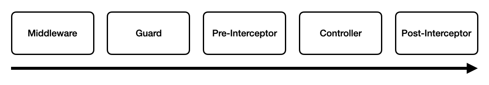

## Middleware
- 클라이언트로부터 들어온 요청을 각 컨트롤러의 요청 핸들러가 처리하기 이전에 코드를 실행할 수 있는 기능

### Middleware 의 종류
- Globally bound Middleware
  - 모든 요청 전에 전처리를 담당하는 미들웨어
- Module bound Middleware
  - 지정한 모듈에 속한 요청의 전처리만 담당하는 미들웨

### Middleware 적용
```typescript
// LoggerMiddleware
@Injectable()
export class LoggerMiddleware implements NestMiddleware {
  private logger = new Logger('HTTP');

  use(request: Request, response: Response, next: NextFunction): void {
    const { ip, method, originalUrl } = request;

    response.on('finish', () => {
      const { statusCode } = response;
      const contentLength = response.get('content-length');
      this.logger.log(`${method} ${originalUrl} ${statusCode} ${contentLength} - ${ip}`);
    });
    next();
  }
}

@Module({
  imports: [],
  controllers: [AppController],
  providers: [AppService],
})
export class AppModule {
  // AppModule 의 모든 요청에 LoggerMiddleware 를 적용
  configure(consumer: MiddlewareConsumer): any {
    consumer.apply(LoggerMiddleware).forRoutes('*');
  }
}
```

### Middleware 와 Interceptor 의 순서
